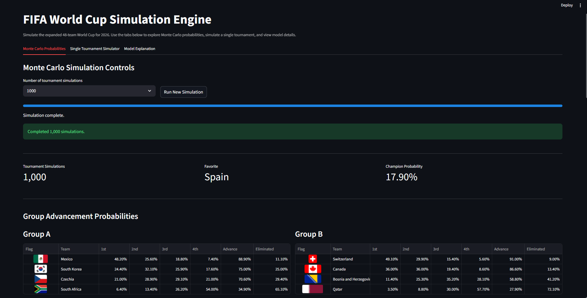
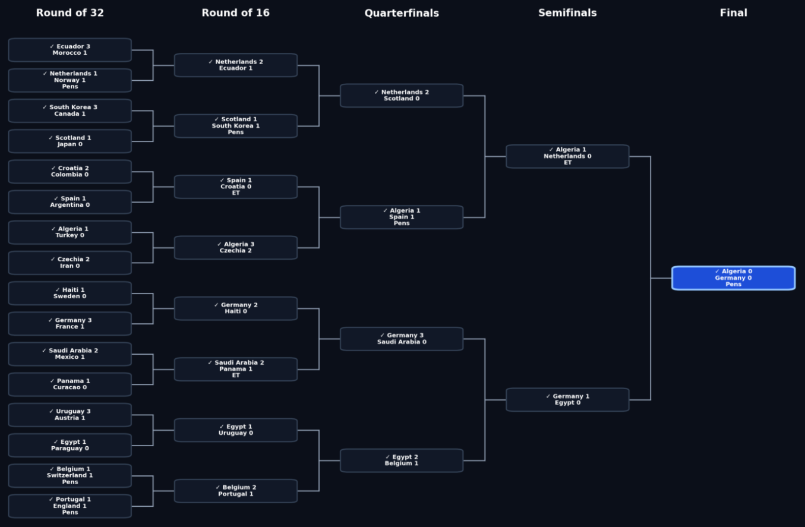
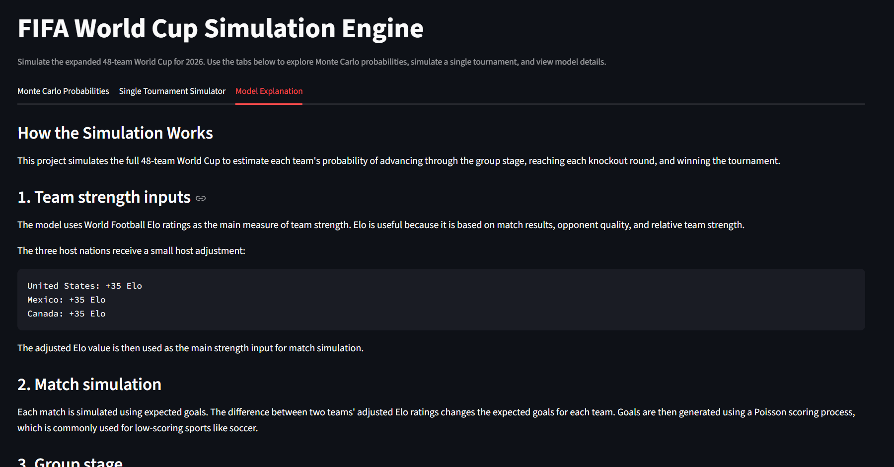

# FIFA World Cup Simulation Engine

This project is a Python and Streamlit-based FIFA World Cup simulation engine. It uses Elo-based team ratings and Monte Carlo simulation to estimate each team’s probability of advancing through the group stage, reaching each knockout round, and winning the tournament.

The simulator follows the 2026 World Cup structure, including the 48-team group stage, best third-place qualification, official knockout path, and FIFA third-place assignment mapping. Users can view saved simulation probabilities, run new simulations, and generate a single full tournament with group tables and a visual knockout bracket.

## Project Overview

The goal of this project is to create an interactive and explainable World Cup prediction tool. Instead of making one fixed bracket prediction, the app simulates the tournament many times to estimate a range of possible outcomes.

The project includes:

* Monte Carlo tournament simulation
* Elo-based team strength ratings
* Host-country Elo adjustment
* Group-stage simulation
* Best third-place team qualification
* Official FIFA-style knockout bracket path
* Extra time and penalty shootout logic
* Single tournament simulator
* Visual knockout bracket
* Streamlit web app interface

## App Screenshots

### Monte Carlo Probability Dashboard



### Single Tournament Knockout Bracket



### Model Explanation



## Features

### Monte Carlo Probabilities

The app can run many full tournament simulations and estimate each team’s probability of:

* Finishing 1st, 2nd, 3rd, or 4th in its group
* Advancing from the group stage
* Reaching the Round of 16
* Reaching the Quarterfinals
* Reaching the Semifinals
* Reaching the Final
* Winning the World Cup

### Single Tournament Simulator

The app can also simulate one complete tournament from start to finish, showing:

* Group tables
* Group match results
* Knockout bracket
* Tournament champion

### Official Tournament Structure

The simulator follows the 2026 World Cup format:

* 48 teams
* 12 groups of 4
* Top 2 teams from each group qualify automatically
* 8 best third-place teams qualify
* 32-team knockout stage
* Official FIFA-style knockout path
* Official third-place assignment mapping

## Modeling Approach

Team strength is based on World Football Elo ratings. Elo ratings are used as the main measure of team quality because they account for match results, opponent strength, and relative team performance over time.

The three host nations receive a small Elo boost:

* United States: +35 Elo
* Mexico: +35 Elo
* Canada: +35 Elo

Match outcomes are simulated using an expected-goals approach. The difference between two teams’ adjusted Elo ratings changes each team’s expected goals, and goals are then generated using a Poisson process.

Group-stage matches can end in draws. Knockout matches include extra time and penalty shootouts if the match is tied after regulation.

## Group Stage Tiebreakers

Group tables are ranked using the following simplified FIFA-style tiebreaker order:

1. Points
2. Head-to-head points among tied teams
3. Overall goal difference
4. Overall goals scored
5. Team rating fallback

The rating fallback is used instead of deeper tiebreakers that are not modeled, such as fair play points or drawing of lots.

## Project Structure

```text
World Cup Simulation Engine/
│── app/
│   └── world_cup_app.py
│
│── data/
│   ├── raw/
│   │   ├── world_cup_groups.csv
│   │   ├── team_elo_ratings.csv
│   │   ├── team_ratings.csv
│   │   └── third_place_mapping.csv
│   │
│   └── processed/
│       ├── simulation_results.csv
│       ├── simulation_results_formatted.csv
│       └── simulation_metadata.json
│
│── src/
│   ├── load_data.py
│   ├── simulate_match.py
│   ├── simulate_group_stage.py
│   ├── simulate_tournament.py
│   ├── run_simulations.py
│   ├── format_results.py
│   ├── build_team_ratings_from_elo.py
│   ├── extract_third_place_mapping.py
│   └── bracket_mapping.py
│
│── requirements.txt
│── README.md
│── .gitignore
```

## How to Run the Project

### 1. Install dependencies

```bash
pip install -r requirements.txt
```

### 2. Generate simulation results

```bash
python src/run_simulations.py
python src/format_results.py
```

### 3. Run the Streamlit app

```bash
streamlit run app/world_cup_app.py
```

## Requirements

The project uses the following main Python packages:

```text
streamlit
pandas
numpy
matplotlib
requests
pdfplumber
```

## Data Sources

This project uses manually collected World Football Elo ratings as the main team-strength input.

The official third-place assignment mapping was extracted from FIFA’s 2026 World Cup regulations PDF and saved as a structured CSV file. The raw PDF is not required to run the app once the mapping CSV has been generated.

## Current Limitations

This version is designed to be clean, explainable, and portfolio-ready, but it does not include every possible factor that could affect real-world tournament outcomes.

Current limitations include:

* No player injuries
* No squad selection data
* No recent form adjustment
* No separate attack and defense ratings
* No tactical matchup modeling
* No travel or rest effects
* No yellow/red card fair play tiebreakers
* No live odds or betting market data

## Future Improvements

Potential future improvements could include:

* Separate attack and defense ratings
* Player availability adjustments
* More advanced expected-goals modeling
* Historical backtesting
* Interactive team comparison tools

## Purpose

This project was built as a data analytics and simulation portfolio project. It demonstrates data preparation, probabilistic modeling, Monte Carlo simulation, tournament logic, Python programming, and interactive dashboard development with Streamlit.
